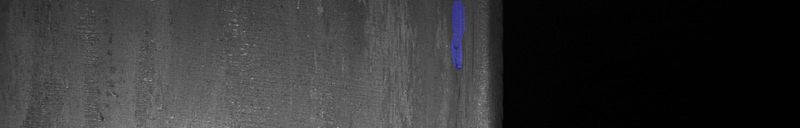
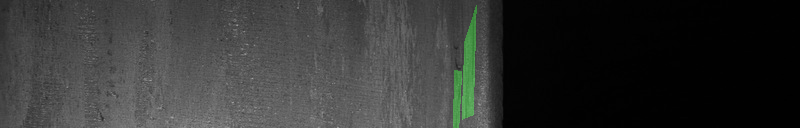
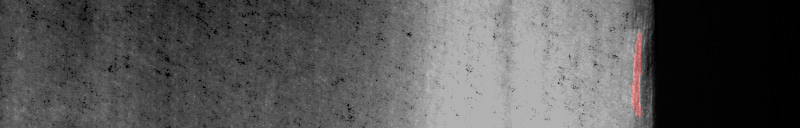
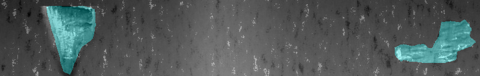
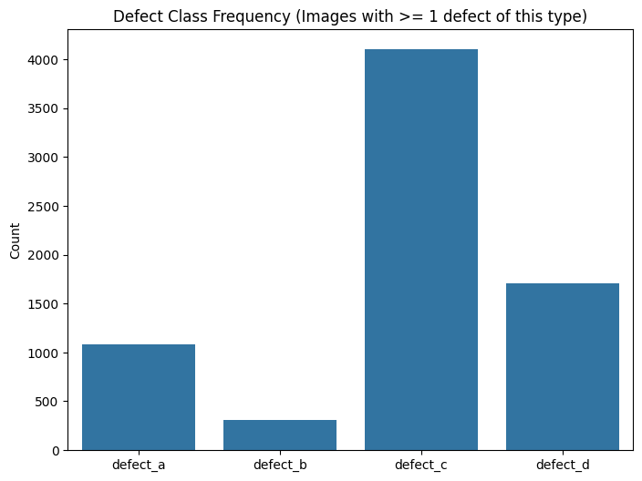

# Class Imbalance, Anomaly Sparsity, and Multi-Label Cardinality
*(Preparing for Milestone 1: Questions 1 & 2)*

---

## 1. The Engineering Context: Defect Inspection in Continuous Manufacturing
Imagine standing next to an industrial rolling line where hot or cold steel sheets move at speeds exceeding $15\text{ meters/second}$. High-speed cameras photograph every centimeter of the surface.

In a functional factory:
* **The vast majority of material is flawless:** Producing scrap is prohibitively expensive. Therefore, most camera frames capture pristine, defect-free material.
* **Defects are rare physical anomalies:** Faults occur due to mechanical abrasion, foreign particles on rollers, localized cooling stresses, or chemical inclusions.
* **Certain defects are common wear signs, while others are severe and rare:** In production, minor surface scratches occur frequently, but severe longitudinal cracks happen only under extreme strain.

When analyzing the competition dataset, your first objective as a machine learning engineer is to **quantify this imbalance** before training any deep learning models. Why *before*? Because the shape of the data dictates almost every downstream decision you will make: which loss function you choose, whether you reweight classes, how you split train from validation, and how you interpret your metrics. A model trained and evaluated without understanding the imbalance will look like it "works" while silently detecting nothing.

Here is what each of the four defect families looks like up close:







*Figure 1.0: Canonical examples of the four defect families. Pay attention to how different their visual signatures are — this will matter again in Guide 5.*

Notice how different these four look — one might be a broad patch, another a thin crack, another a subtle texture change, another something else entirely. This visual variety is exactly why "detect anomalies" cannot be solved with one simple rule. Form your own class-by-class impressions from the images above; a later assignment question asks you to back such impressions with measured statistics rather than eyeballing.

---

## 2. Conceptual Foundation: The Long-Format Annotation Table
Before writing any analysis code, you need to understand *how the labels are stored*. Getting this wrong corrupts every number you compute afterward.

In many datasets (such as COCO or Pascal VOC), annotations are organized hierarchically in JSON: one entry per image, with a list of its labels nested inside. In tabular CSV benchmarks, annotations frequently use a **long format** instead — **multiple rows per image**, one row per (image, defect-class) pair:

```text
image_id,defect_type,mask_rle,width,height
img_001,defect_a,,800,128
img_001,defect_b,,800,128
img_001,defect_c,100 5 150 10...,800,128
img_001,defect_d,,800,128
```

Read this example carefully. `img_001` has **four rows** — one for each of the four possible defect classes. In this hypothetical case, only `defect_c` has an actual mask (a non-empty `mask_rle` string); the other three rows have an empty field, meaning that defect is *absent* from this image.

### Why "long format" matters to you:
It means **the number of rows is NOT the number of images.** If you naively do `len(df)`, you will get 4× the image count (one row per class per image). This is the single most common beginner mistake when first opening `train.csv`.

### Key Structural Concepts to Verify:
1. **Total Rows vs. Unique Images:** If there are $C$ possible defect classes and every image has a row for each class, the total number of rows in your dataframe must be:
   $$\text{Total Rows} = \text{Unique Images} \times C$$
   In this competition $C = 4$. So your first sanity check is: does `df.shape[0] == df['image_id'].nunique() × 4`? If it does, you have understood the structure.

2. **Defect Presence Indicator:** In this format, how do you distinguish whether an image has a defect or not? Look at the `mask_rle` column:
   * A missing (`NaN`) or empty string signifies **absence** ($y = 0$) — this image has no pixels of that defect class.
   * A non-empty string (like `"100 5 150 10..."`) signifies **presence** ($y = 1$) — this image has pixels of that defect class, and the string tells you *where* (we decode exactly how in Guide 3).

3. **Completely Clean Images:** An image is defined as "clean" if **all $C$ rows** corresponding to that image are empty. In other words, an image is clean when *none* of its four `mask_rle` fields contain a mask. Clean images are the "negative" examples — no defect of any type.

### Tiny Worked Example
Imagine a dataset with 3 images and $C = 3$ classes:

| image_id | defect_a | defect_b | defect_c | Clean? |
|----------|----------|----------|----------|--------|
| img_001  | empty    | empty    | "10 5..."| No (has defect_c) |
| img_002  | empty    | empty    | empty    | **Yes** |
| img_003  | "20 3..."| empty    | "50 8..."| No (has a & c) |

* Total rows = 3 images × 3 classes = 9.
* img_002 is the only **clean** image (all three empty).
* img_003 is a **multi-label** image (defect_a *and* defect_c present) — this is the pattern Question 2 cares about.

---

## 3. Conceptual Foundation: Multi-Label Defect Cardinality
In single-label classification (e.g., MNIST digit recognition), an image belongs to exactly one class — a picture of a "7" is never also a "3." In **multi-label problems**, an image can simultaneously exhibit $0, 1, 2, \dots, C$ defects. A single steel strip can have a scratch *and* a crack at the same time.

### What "Cardinality" Means, Intuitively
"Cardinality" is just the fancy word for **how many labels are switched on** for a given image. Think of it as reading a row of checkboxes: how many boxes are ticked?

### Mathematical Formulation
Let each image $i$ be represented by a binary vector $\mathbf{y}_i = [y_{i,1}, y_{i,2}, \dots, y_{i,C}] \in \{0, 1\}^C$, where $y_{i,c} = 1$ if defect class $c$ is present and $0$ otherwise.

For example, with $C = 4$ classes:
* An image with only `defect_c`: $\mathbf{y} = [0, 0, 1, 0]$ → cardinality 1.
* An image with `defect_a` and `defect_d`: $\mathbf{y} = [1, 0, 0, 1]$ → cardinality 2.
* A clean image: $\mathbf{y} = [0, 0, 0, 0]$ → cardinality 0.

* **Label Cardinality:** The number of labels present on image $i$ (i.e., the number of 1s in the vector):
  $$|\mathbf{y}_i| = \sum_{c=1}^C y_{i,c}$$
* **Cardinality Distribution:**
  * $|\mathbf{y}_i| = 0$: Completely clean image (no defect at all).
  * $|\mathbf{y}_i| = 1$: Single defect present (the common case for defective images).
  * $|\mathbf{y}_i| \ge 2$: Multi-label co-occurrence (multiple defect types appearing on the same sheet).

### Why the Distribution Shape Matters
The **cardinality distribution** is a histogram over images: the x-axis is "number of defect labels" (0, 1, 2, 3, 4) and the y-axis is "how many images have that many labels." Its shape tells you the fundamental character of the dataset:
* A spike at 0 means most images are clean (the expected "rare anomaly" scenario).
* A long tail at $\ge 2$ means co-occurrence is common — you cannot treat classes as mutually exclusive in your data handling.

Before you touch the code, predict: in an 11,393-image industrial dataset where defects cover $<0.02\%$ of pixels, which outcome should dominate the cardinality histogram — $|\mathbf{y}_i| = 0$ or $|\mathbf{y}_i| \ge 2$? Then verify your prediction by counting the real data yourself in the assignment task below.


*Figure 1.2: Number of positive rows per defect class. Which class sits at the top of the frequency table — and which at the bottom? Reading the shape is not enough for your assignment: you must count the exact values from the CSV yourself.*

---

## 4. Why This Understanding is Vital for Model Design
This is not academic pedantry. Two concrete consequences follow directly from the data's sparsity:

* **The Accuracy Paradox:** Suppose $80\%$ of your individual image-class pairs are defect-free. A "model" that is completely blind — one that always outputs "clean" — gets $80\%$ accuracy while **failing to detect a single defect.** Accuracy rewards doing nothing when negatives dominate. This is precisely why anomaly detection benchmarks use Dice-based metrics (Guides 6–8) instead of accuracy: they focus on the rare positive cases that actually matter.

* **Loss Function Behavior:** If you train a standard Binary Cross-Entropy (BCE) loss without class weights, your loss is dominated by the massive number of background pixels and common defects. The gradient signal says, in effect, "predict background, predict background, predict background" — and the model learns to ignore rare defects entirely because ignoring them barely changes the loss. Rare defects will be overlooked unless you rebalance the loss (e.g., pos_weight, focal loss — see the Focal Loss paper in the readings).

### The Two Questions These Concepts Feed
Keep the following mapping in mind as you work through the milestone:
* **Question 1** wants you to *quantify* the imbalance: count positives per class and count clean images, then combine those two numbers.
* **Question 2** wants you to quantify **co-occurrence**: how many images have two or more labels simultaneously (cardinality $\ge 2$).

---

## 5. Official Trusted Resources & Recommended Reading
* **Scikit-learn User Guide:** [Multiclass and Multi-output Algorithms](https://scikit-learn.org/stable/modules/multiclass.html) (Read sections on multi-label classification and indicator matrices).
* **Tsoumakas, G., & Katakis, I. (2007).** *Multi-label classification: An overview*. International Journal of Data Warehousing and Mining, 3(3), 1–13. [DOI: 10.4018/jdwm.2007070101](https://doi.org/10.4018/jdwm.2007070101).
* **Lin, T. Y., et al. (2017).** *Focal Loss for Dense Object Detection*. ICCV 2017. [arXiv:1708.02002](https://arxiv.org/abs/1708.02002).

---

## 6. Practice Problems: Long-Format Counting on a Toy Dataset

Work these problems *before* opening the real assignment. The numbers are tiny and completely different from the graded task, so you can verify every step by hand.

### Practice Problem 1.1 — Pivot the toy CSV
Here is a toy long-format annotation table with $C = 3$ classes:

```text
image_id,defect_type,mask_rle
img_101,defect_a,10 5
img_101,defect_b,
img_101,defect_c,
img_202,defect_a,
img_202,defect_b,20 3
img_202,defect_c,30 4
img_303,defect_a,
img_303,defect_b,
img_303,defect_c,
img_404,defect_a,7 2
img_404,defect_b,
img_404,defect_c,
img_505,defect_a,50 6
img_505,defect_b,60 2
img_505,defect_c,
```

1. How many **rows** are in the table? How many **unique images**? Does the rows $=$ images $\times C$ sanity check pass?
2. How many positive (non-empty `mask_rle`) rows does **each class** have? Which class is most frequent?
3. How many images are **completely clean**?
4. What is the **cardinality distribution** — how many images have 0, 1, and $\ge 2$ classes present?
5. Which images are multi-label (cardinality $\ge 2$)?

<details>
<summary><b>Worked Solution</b></summary>

1. 15 rows, 5 unique images, $15 = 5 \times 3$ ✓.
2. Count non-empty `mask_rle` rows per class:
   * `defect_a`: img_101, img_404, img_505 → **3**
   * `defect_b`: img_202, img_505 → **2**
   * `defect_c`: img_202 → **1**
   * Most frequent: **`defect_a`** with 3 positives.
3. An image is clean only if all three of its rows are empty: only **img_303** → **1 clean image**.
4. Per image, count distinct classes with non-empty masks:
   * img_101 → {a} → cardinality 1
   * img_202 → {b, c} → cardinality 2
   * img_303 → {} → cardinality 0
   * img_404 → {a} → cardinality 1
   * img_505 → {a, b} → cardinality 2
   * Distribution: **0 labels → 1 image; 1 label → 2 images; ≥2 labels → 2 images**.
5. **img_202 and img_505** (2 multi-label images).

The same pandas skeleton works on the real CSV — only the numbers change:

```python
import pandas as pd
df = pd.read_csv('toy.csv')                       # your toy table (or train.csv)
df['has'] = df['mask_rle'].notna() & (df['mask_rle'].str.strip() != '')
pos = df[df['has']]
print(pos['defect_type'].value_counts())          # per-class positives
per_image = pos.groupby('image_id')['defect_type'].nunique()
print(per_image.value_counts().sort_index())      # cardinality distribution
clean = df['image_id'].nunique() - pos['image_id'].nunique()
print('clean:', clean)
```

</details>

### Practice Problem 1.2 — Sanity-check your counts
Using the toy table above, answer *yes or no*, and explain:

1. Is the multi-label image count (2) smaller than the number of defective images (4)? It must be — why?
2. If a colleague reported "most frequent class count = 3 and clean = 1," what single sum would they compute, and does each addend come from a count of *rows* or of *unique images*?

<details>
<summary><b>Worked Solution</b></summary>

1. **Yes.** Multi-label images are a strict subset of defective images (every multi-label image is by definition defective), so the count can never exceed the defective total: $2 \le 4$ ✓.
2. They would compute $3 + 1 = 4$. The first addend is a count of **rows** filtered by class (positive rows for `defect_a`); the second is a count of **unique images** whose four rows are all empty. Mixing these two units is the classic bug — always write down which unit you are counting.

</details>

---

## 7. Your Assignment Task

Open the graded assignment: [`MILESTONE_1.md`](../../MILESTONE_1.md)

* **Question 1** asks you to apply Practice Problem 1.1's counting method to `data/public/train.csv`: per-class positive counts, clean-image count, then one arithmetic combination of them.
* **Question 2** asks you to apply the cardinality-distribution method from Practice Problem 1.1(4) to the same file.

Work with the real CSV, record the exact integers your script prints, and double-check each count against the sanity questions in Practice Problem 1.2. No answer is provided here — the numbers you produce from the data *are* your answer.
