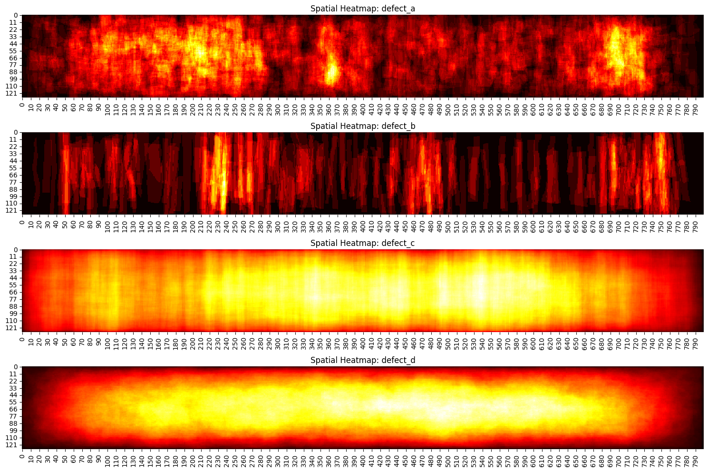

# Guided Learning: Spatial Mutual Exclusivity and Output Architecture
*(Preparing for Milestone 1: Question 3)*

---

## 1. The Core Architectural Question: Sigmoids vs. Softmax
When designing a semantic segmentation network (such as a U-Net or DeepLab), your model processes an input image and outputs a tensor of logits:
$$\mathbf{Z} \in \mathbb{R}^{K \times H \times W}$$
where $H$ and $W$ are spatial height and width, and $K$ is the number of prediction channels.

**What is a "logit"?** A logit is the raw, unbounded number the network emits *before* any activation function squashes it into a probability. The activation function you choose decides *how the $K$ channels relate to each other* — and that choice must reflect the physics of your problem.

How should you activate these logits? In deep learning, you have two primary options:

```
Option A: Multi-Label (K = 4 Independent Sigmoids)
Logits Z_1, Z_2, Z_3, Z_4  ──►  [ σ(z_1), σ(z_2), σ(z_3), σ(z_4) ]
Each pixel can independently be Class A, Class B, Class C, and Class D.

Option B: Multi-Class Partition (K = 5 Softmax over [BG + 4 Defects])
Logits Z_0, Z_1, Z_2, Z_3, Z_4  ──►  Softmax across channels
Enforces: P(BG) + P(A) + P(B) + P(C) + P(D) = 1.0 at every pixel!
```

### How each option works, in plain terms:
* **Independent Sigmoids (Option A):** Each channel passes through the sigmoid function $\sigma(z) = \frac{1}{1+e^{-z}}$ *separately*. Because sigmoids never talk to each other, the four outputs are completely independent: channel A could say $0.9$ while channel C also says $0.9$ for the same pixel. Nothing stops "impossible" combinations.
* **Softmax (Option B):** The softmax function takes *all five* logits together and normalizes them so they sum to 1.0:
  $$\text{Softmax}(z_k) = \frac{e^{z_k}}{\sum_{j=0}^{K-1} e^{z_j}}$$
  Because they must sum to 1, raising one channel *forces* the others down. A pixel cannot be $80\%$ background *and* $80\%$ defect — the math forbids it.

### Which one you should pick depends entirely on one empirical question: **can two defect types occupy the same pixel?** If not, Softmax is the physically honest choice. If yes, you need independent Sigmoids. That is exactly what Question 3 asks you to determine from the data.

---

## 2. The Physical Constraint: Surface Anomaly Physics
Architecture choices should follow the physics of the world, not fashion. Let's build the intuition.

In natural scene segmentation (e.g., segmenting a "person" riding a "bicycle"), bounding boxes overlap, but pixel masks are mutually exclusive (a pixel is either human skin or bike metal — never both at once).

Now translate this to a steel strip:
* Does an abrasive roll mark physically share the exact same pixels as a longitudinal hairline crack?
* Or are defects physically discrete events occurring on separate regions of the sheet?

Think about how defects form: a scratch is created by one mechanical event, a crack by another stress. At any single $(x, y)$ location on the sensor, the surface is in *one* physical state — scratched, cracked, stained, or pristine. Two different defect mechanisms cannot simultaneously mark the exact same square micron of steel.

If defects never overlap spatially on the sensor canvas, treating them as independent binary channels (Sigmoids) allows the network to make a physically impossible prediction: predicting that a pixel is simultaneously $80\%$ `defect_a` and $80\%$ `defect_c`. A Softmax head structurally *cannot* make that error — its outputs are forced to partition the probability mass.

> **Key Insight:** The question "Sigmoid or Softmax?" is really the question *"Is the ground truth disjoint or not?"* You must check the data to answer it — you cannot assume.

---

## 3. Mathematical Verification of Spatial Exclusivity
To determine whether you should use independent Sigmoids or a mutually exclusive Softmax, you must conduct an empirical audit of the ground truth. Do not guess — **measure**.

### Overlap Test Between Binary Masks:
Let $M_A \in \{0, 1\}^{H \times W}$ and $M_B \in \{0, 1\}^{H \times W}$ be the ground truth binary masks of two distinct defect classes for the same image.
* The number of overlapping pixels between class $A$ and class $B$ is given by the inner product (or elementwise logical AND):
  $$\text{Overlap}(A, B) = \sum_{y=1}^H \sum_{x=1}^W (M_A(y, x) \land M_B(y, x)) = \sum_{y=1}^H \sum_{x=1}^W (M_A(y, x) \cdot M_B(y, x))$$

**What this formula does, step by step:** It walks over every pixel position $(y, x)$ on the canvas. At each pixel it asks: "Is this pixel marked as defect $A$ **AND** marked as defect $B$?" If both are 1, the product is 1; otherwise 0. Summing over all pixels gives *the count of pixels that both defects claim simultaneously*.

* If the sum is **0**, the two masks never touch — they are disjoint at that image.
* If the sum is **positive**, some pixels are claimed by both classes.

Run this for **every pair** of defect classes on **every multi-defect image** in the dataset:
* If $\text{Overlap}(A, B) = 0$ for all pairs of defect classes across all images in the dataset, then the defect classes form a **strictly disjoint spatial partition** of the canvas.
* If you find **any** positive overlap anywhere, the classes are *not* disjoint, and a mutually-exclusive head would be structurally unable to represent the data.

**Both outcomes must be reasoned about before you write the answer to Question 3** — the point of the audit is that the *data*, not your intuition, decides which architecture is physically justified.

Inspect the evidence visually before you run the overlap test. Each defect type occupies a characteristic region of the strip:


*Figure 2.1: Where on the $128 \times 800$ canvas does each defect tend to occur? Do any two classes' territories ever visually coincide? Visual heatmaps can suggest an answer — only the pixel-wise intersection test can prove it.*

---

## 4. Official Trusted Resources & Recommended Reading
* **Goodfellow, I., Bengio, Y., & Courville, A. (2016).** *Deep Learning* (Chapter 6.2.2: Softmax Units for Multinoulli Output Distributions). MIT Press. [Deep Learning Book Online](https://www.deeplearningbook.org/contents/mlp.html).
* **Ronneberger, O., Fischer, P., & Brox, T. (2015).** *U-Net: Convolutional Networks for Biomedical Image Segmentation*. MICCAI 2015. [arXiv:1505.04597](https://arxiv.org/abs/1505.04597).
* **PyTorch Official Documentation:**
  * [`torch.nn.CrossEntropyLoss`](https://pytorch.org/docs/stable/generated/torch.nn.CrossEntropyLoss.html) (Notice that PyTorch CrossEntropyLoss expects mutually exclusive class indices $\{0, 1, \dots, C-1\}$).
  * [`torch.nn.BCEWithLogitsLoss`](https://pytorch.org/docs/stable/generated/torch.nn.BCEWithLogitsLoss.html).

---

## 5. Practice Problems: Overlap Auditing on Toy Masks

### Practice Problem 2.1 — Count the overlap on a toy pair
On a toy $4 \times 4$ canvas, two defect classes appear on the same image:

```python
import numpy as np

M_A = np.array([[0, 0, 0, 0],
                [0, 1, 1, 0],
                [0, 0, 0, 0],
                [0, 0, 0, 0]])

M_B = np.array([[0, 0, 0, 0],
                [0, 0, 1, 0],
                [0, 0, 1, 0],
                [0, 0, 0, 0]])
```

1. Compute $\text{Overlap}(A, B)$ with the elementwise product formula.
2. Now place a third class on the *same* image: `M_C` has a single pixel at $(y{=}3, x{=}1)$ and zeros elsewhere. Compute $\text{Overlap}(A, C)$ and $\text{Overlap}(B, C)$.
3. If an entire dataset's audit produced overlap $= 0$ for **every** class pair on **every** image — which output head (4 independent sigmoids vs. 5-way softmax) does the evidence justify, and why?
4. What would you conclude instead if the audit found positive overlaps on some images?

<details>
<summary><b>Worked Solution</b></summary>

1. Elementwise product:
   ```python
   overlap = np.logical_and(M_A, M_B).sum()   # or (M_A * M_B).sum()
   ```
   Only position $(1, 2)$ is 1 in both masks → **overlap = 1 pixel**. The classes are *not* disjoint on this toy image.
2. `M_C`'s only pixel $(3,1)$ is 0 in both `M_A` and `M_B` → **overlap = 0** for both pairs. Note that disjointness must hold for *every* pair on *every* image — one positive pair anywhere breaks strict exclusivity.
3. With all-zero overlaps everywhere, the ground truth is a mutually exclusive partition (background + 4 defects). A **5-way softmax head** is then the physically honest choice: it structurally forbids two classes claiming one pixel, matching the label structure exactly — and no information in the labels is lost, because the classes never co-occur at a pixel.
4. Positive overlaps mean the label structure is genuinely multi-label at the pixel level. A softmax head would then be *incapable* of representing parts of the ground truth (it forces one winner per pixel), so you would need **4 independent sigmoid channels** trained with BCE-style losses.

</details>

### Practice Problem 2.2 — Prove it on a tiny canvas by brute force
Using the three toy masks $M_A$, $M_B$, $M_C$ from Practice Problem 2.1 (all on one $4 \times 4$ image), write a loop over *all* class pairs and report a 3×3 symmetric overlap matrix. Which matrix entries must be zero for the dataset to qualify as a strict partition — the diagonal, the off-diagonals, or both? (And what do the diagonal entries always equal, by definition?)

<details>
<summary><b>Worked Solution</b></summary>

```python
masks = {'A': M_A, 'B': M_B, 'C': M_C}
keys = list(masks)
M = np.zeros((3, 3), dtype=int)
for i, a in enumerate(keys):
    for j, b in enumerate(keys):
        M[i, j] = int(np.logical_and(masks[a], masks[b]).sum())
print(M)
```

* The **off-diagonal** entries are the cross-class overlaps — *these* must all be zero for a strict partition. Here `M[A,B] = 1`, so the toy data fails the test.
* The **diagonal** entries are each mask intersected with itself, which by definition equals that mask's pixel count ($|M_A|$, $|M_B|$, $|M_C|$) — they are never zero unless the mask is empty. Do not mistake a non-zero diagonal for an overlap!
* Symmetry ($M[i,j] = M[j,i]$) is a free correctness check on your loop.

</details>

---

## 6. Your Assignment Task

Open the graded assignment: [`MILESTONE_1.md`](../../MILESTONE_1.md)

* **Question 3** asks you to run Practice Problem 2.1's intersection test — but for real: decode the masks of every multi-label image in `data/public/train.csv` onto the native $(128, 800)$ canvas (use the `rle_decode` pattern from Guide 3), accumulate $\text{Overlap}(A, B)$ across **all** class pairs and **all** such images, and report the total.
* Then do what Practice Problem 2.1(3)–(4) trained you to do: interpret your measured total and justify the output-head choice it implies for your baseline architecture.

The audit result is not stated anywhere in these guides — you must measure it.
