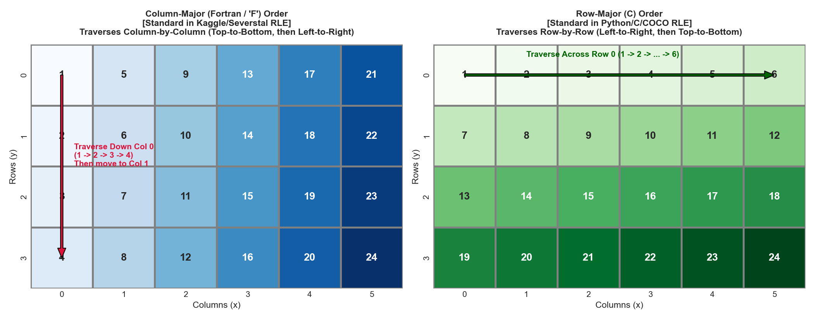

# Guided Learning: Run-Length Encoding (RLE) and Memory Layouts
*(Preparing for Milestone 1: Question 4)*

---

## 1. Why RLE?
A dataset of $11,393$ images at $128 \times 800$ resolution contains over $1.16$ billion pixels. If stored as uncompressed byte masks, this would require gigabytes of disk space and slow down data loading pipelines.

Because surface defects are sparse ($>96\%$ of pixels are background), **Run-Length Encoding (RLE)** compresses masks by storing only the start position and length of consecutive defect runs.

### How RLE works, with a tiny picture
Suppose a single row of a mask (flattened to 1D) looks like this:

```
Index:  1 2 3 4 5 6 7 8 9 10 ... 50 51 52 ... 102400
Value:  0 0 0 1 1 1 0 0 0 0  ...  0  1  1  ...     0
```

Instead of storing $102{,}400$ zeros and ones, RLE stores just the runs of 1s: *"start at index 4, run length 3"* and *"start at index 51, run length 2."* Written as a flat string: `"4 3 51 2"`.

The full mask is a sequence of `start length start length ...` pairs — spaces separate the integers, and you read them two at a time. **Start positions are 1-based** (the first pixel of the image is index 1, not 0), which is a common source of off-by-one bugs.

---

## 2. Memory Order: Fortran (Column-Major) vs. C (Row-Major)
The single most common bug in segmentation competitions is decoding an RLE string using the wrong memory order! This is the trickiest concept in this guide, so let's go slowly.

A 2D mask is really just a 2D *view* of a flat 1D array in memory. When you convert between the flat 1D sequence (which is what RLE indexes into) and the 2D grid $(H, W)$, you must pick a **traversal order** — the order in which you "walk" the grid to produce the flat sequence. Two orders exist, and they produce completely different flat sequences from the same image:


*Figure 3.1: Visualizing Column-Major (Fortran) vs. Row-Major (C) 2D grid flattening.*

### The Two Conventions:
1. **Row-Major (C-Order):**
   * Traversal moves horizontally across rows (left-to-right, then down to the next row): $(0,0) \to (0,1) \to (0,2) \to \dots \to (1,0) \to \dots$
   * Index formula for pixel $(y, x)$:
     $$k_{\text{row}} = y \cdot W + x$$
   * Standard in C, C++, OpenCV, NumPy default, and COCO RLE.
2. **Column-Major (Fortran-Order):**
   * Traversal moves vertically down columns (top-to-bottom, then right to the next column): $(0,0) \to (1,0) \to (2,0) \to \dots \to (0,1) \to \dots$
   * Index formula for pixel $(y, x)$:
     $$k_{\text{col}} = x \cdot H + y$$
   * Standard in Fortran, MATLAB, and Kaggle/Severstal competitions.

> **Crucial Rule:** In this competition, RLE strings are **1-indexed and Column-Major (Fortran order)**!
> Pixel index $1$ is $(y=0, x=0)$. Pixel index $2$ is $(y=1, x=0)$ — the pixel *directly below* the first. Pixel index $H+1$ ($129$) is $(y=0, x=1)$ — the start of the second column.

### Worked Example: Where does index 130 land?
Using the column-major formula $k = x \cdot H + y$ with $H = 128$:
* The first column occupies indices $1$ through $128$ (in 1-based terms).
* The second column starts at index $129$.
* So 1-based index $130 = x \cdot 128 + y + 1$ with $x = 1, y = 1$ → pixel $(y=1, x=1)$.

If you had (incorrectly) used row-major, index 130 would land somewhere in row 1 — a completely different pixel. The symptom of this bug is masks that look "shifted" or "smeared" along the wrong axis.

> **Sanity check:** Decode one mask, plot it, and confirm the defect looks like a coherent blob — not a set of scattered stripes. If you see stripes, you almost certainly used the wrong `order`.

---

## 3. The RLE Format in `train.csv`
RLE strings consist of space-delimited integer pairs:
```text
"29102 12 29220 24"
```
* Pair 1: Starts at 1-based flat index $29,102$ and extends for $12$ pixels (covers indices $29,102$ through $29,113$).
* Pair 2: Starts at 1-based flat index $29,220$ and extends for $24$ pixels (covers indices $29,220$ through $29,243$).

**Reading it as a whole:** this mask has two separate "runs" of defect pixels. Everything *between* the runs (indices $29,114$–$29,219$) and everything outside them is background (0).

### The Standard Decoding Pattern:
```python
import numpy as np

def rle_decode(rle_str, mask_shape=(128, 800)):
    flat = np.zeros(mask_shape[0] * mask_shape[1], dtype=np.uint8)
    if not rle_str or pd.isna(rle_str):
        return flat.reshape(mask_shape, order='F')   # empty mask: all zeros

    tokens = [int(x) for x in str(rle_str).split()]
    starts = np.array(tokens[0::2]) - 1   # convert 1-based start -> 0-based
    lengths = np.array(tokens[1::2])
    ends = starts + lengths               # exclusive end in 0-based terms

    for s, e in zip(starts, ends):
        flat[s:e] = 1                     # mark the whole run as foreground

    return flat.reshape(mask_shape, order='F')  # Fortran = column-major
```

Walk through what each line does:
1. Allocate a flat buffer of $128 \times 800 = 102{,}400$ zeros.
2. If the RLE string is empty/NaN, return the all-zero mask immediately (this is a *clean* image for that class).
3. Split the string into integers; every even-indexed token is a `start`, every odd-indexed one is a `length`.
4. Subtract 1 from starts to convert from 1-based (file convention) to 0-based (Python convention).
5. Fill `flat[s:e] = 1` for each run — note `e` is exclusive in Python slicing, so `starts + lengths` is exactly right.
6. **Reshape with `order='F'`** to get the 2D mask in column-major order.

> **The line that matters most:** `reshape(..., order='F')`. Use `order='C'` and your mask will be scrambled along the wrong axis — the bug we warned about above.

---

## 4. The Edge Case: Canvas Boundary Limits
In real-world industrial data, annotation pipelines are written by humans or automated toolchains that can contain subtle edge-case bugs.

Consider a canvas of shape $H = 128, W = 800$:
* What is the total number of pixels on this canvas?
  $$\text{Total Pixels} = 128 \times 800 = 102,400$$
* In a 1-based indexing system, what is the maximum valid pixel index? Exactly **$102,400$**.
* What happens if an annotation tool computes a run whose ending index exceeds that limit?
  - If your code uses a fixed buffer of size $102,400$, writing out of bounds raises an `IndexError`.
  - If your code dynamically sizes the array, the array length becomes wrong and can no longer be reshaped to $(128, 800)$!

### The Boundary Formula
For every run, the **1-based end index** is:
$$\text{end} = \text{start} + \text{length} - 1$$
The $-1$ accounts for the fact that a run of length $L$ starting at $s$ covers exactly the pixels $s, s+1, \dots, s+L-1$. A row is *malformed* when $\text{end} > H \times W$.

### Mini-Example: Tracing One Run
Suppose a defect mask on a $128 \times 800$ canvas contains the run `"102390 20"`:

* Last 1-based index touched: $102{,}390 + 20 - 1 = 102{,}409$.
* This is **$9$ pixels past** the legal canvas limit of $102{,}400$.
* How much of the run is valid? Exactly $102{,}400 - 102{,}390 + 1 = 11$ pixels.

> **Exercise:** Decide what your decoder should do with those 9 out-of-range pixels — crash, silently resize, or clip them? What does each choice imply for the decoded mask's area?

```python
for s, e in zip(starts, ends):
    flat[max(s, 0):min(e, flat.size)] = 1  # clamp, never crash
```

---

## 5. Official Trusted Resources & Recommended Reading
* **NumPy Documentation:**
  * [`numpy.reshape`](https://numpy.org/doc/stable/reference/generated/numpy.reshape.html) (Pay attention to the `order` parameter).
  * [`numpy.asfortranarray`](https://numpy.org/doc/stable/reference/generated/numpy.asfortranarray.html).
* **Kaggle Evaluation Documentation:**
  [Severstal Defect Detection Evaluation (RLE Specification)](https://www.kaggle.com/c/severstal-steel-defect-detection/overview/evaluation).
* **OpenCV Memory Layout:**
  [OpenCV `cv::Mat` Class Reference](https://docs.opencv.org/4.x/d3/d63/classcv_1_1Mat.html) (Explains row-major storage and memory steps).

---

## 6. Practice Problems: Decode and Boundary-Check a Toy RLE

### Practice Problem 3.1 — Decode `"3 4 10 2"` on a $4 \times 4$ canvas
Let $H = 4$, $W = 4$ (16 pixels total, column-major, 1-based). The RLE string is `"3 4 10 2"`.

1. List the flat indices covered by each run (use $\text{end} = \text{start} + \text{length} - 1$).
2. Convert each covered index to $(y, x)$ coordinates using $k = x \cdot H + y + 1$ (1-based).
3. Draw the resulting $4 \times 4$ mask. How many foreground pixels does it contain?

<details>
<summary><b>Worked Solution</b></summary>

1. Run 1: start 3, length 4 → indices **3, 4, 5, 6**.
   Run 2: start 10, length 2 → indices **10, 11**.
2. With $H = 4$: index $k \mapsto x = \lfloor (k-1)/4 \rfloor$, $y = (k-1) \bmod 4$:
   * $3 \to (2, 0)$, $4 \to (3, 0)$, $5 \to (0, 1)$, $6 \to (1, 1)$
   * $10 \to (1, 2)$, $11 \to (2, 2)$
3. The mask has **6 foreground pixels** at $(y, x) \in \{(0,1), (1,1), (1,2), (2,0), (2,2), (3,0)\}$:
   ```text
   row 0:  . X . .
   row 1:  . X X .
   row 2:  X . X .
   row 3:  X . . .
   ```
   Verify with:
   ```python
   def rle_decode_toy(rle, H=4, W=4):
       flat = np.zeros(H * W, dtype=np.uint8)
       t = [int(x) for x in rle.split()]
       for s, l in zip(t[0::2], t[1::2]):
           flat[s - 1 : s - 1 + l] = 1
       return flat.reshape(H, W, order='F')
   ```
   Note how the column-major order makes runs fall *vertically* first — if your decoded blob looks rotated or striped, check your `order`.

</details>

### Practice Problem 3.2 — Find and clamp boundary violations
Consider this toy CSV (canvas $4 \times 4$, so the maximum valid 1-based index is $16$):

```text
image_id,defect_type,mask_rle
t1,defect_a,3 4 10 2
t1,defect_b,15 4
t2,defect_a,14 3
t2,defect_b,12 4
t3,defect_a,
```

1. For each **non-empty** row, compute $\text{end} = \text{start} + \text{length} - 1$ for *every* run, then take the row's maximum end index.
2. Which rows are malformed ($\text{end} > 16$)? How many are there, and what is the maximum end index across the whole file?
3. Apply clamping (`flat[s-1 : min(e, 16)] = 1`) to the malformed row(s). How many valid pixels survive in each?

<details>
<summary><b>Worked Solution</b></summary>

1. Row-by-row ends:
   * `t1/defect_a` `"3 4 10 2"` → ends $3{+}4{-}1 = 6$, $10{+}2{-}1 = 11$ → max 11 ≤ 16 ✓
   * `t1/defect_b` `"15 4"` → end $15{+}4{-}1 = 18$ → **> 16 ✗**
   * `t2/defect_a` `"14 3"` → end $14{+}3{-}1 = 16$ → 16 ≤ 16 ✓ (just barely)
   * `t2/defect_b` `"12 4"` → end $12{+}4{-}1 = 15$ → ≤ 16 ✓
   * `t3/defect_a` empty → no runs, skip.
2. **1 malformed row** (`t1/defect_b`); **maximum end index = 18**.
3. The run wants indices 15–18, but only 15 and 16 exist → after clamping, **2 foreground pixels** survive (at 1-based indices 15 and 16, i.e. $(y{=}2, x{=}3)$ and $(y{=}3, x{=}3)$). Clamping preserves the valid prefix instead of crashing or shifting the array.

</details>

---

## 7. Your Assignment Task

Open the graded assignment: [`MILESTONE_1.md`](../../MILESTONE_1.md)

* **Question 4** asks you to run Practice Problem 3.2's boundary audit on the real `data/public/train.csv`: scan every non-empty `mask_rle`, apply the $\text{end} = \text{start} + \text{length} - 1$ formula to every run, and report how many rows exceed the canvas limit plus the largest index you observe.
* Make sure your production `rle_decode` includes the clamping behavior from Practice Problem 3.2(3), scaled to the real canvas size.

The file's rows will tell you whether any annotation bug survived into the released data — count, do not assume.
