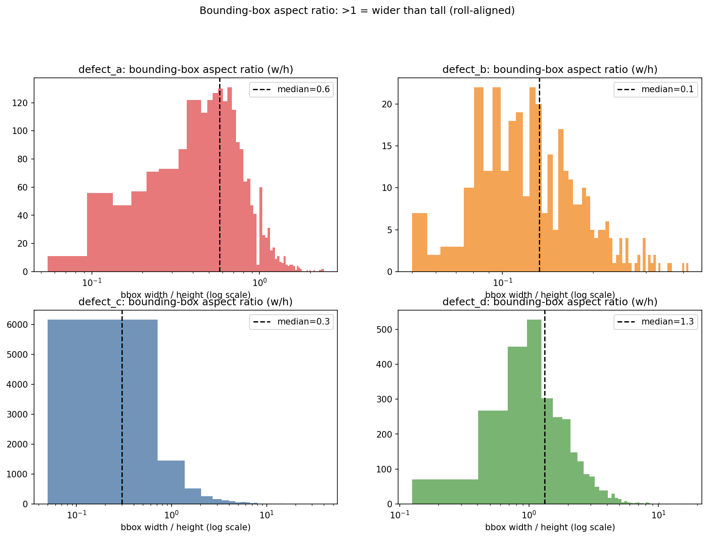

# Guided Learning: Sensor Aspect Ratios, Line-Scan Cameras, and Aliasing
*(Preparing for Milestone 1: Question 5)*

---

## 1. Physical Sensor Geometry: The Industrial Line-Scan Camera
In standard computer vision benchmarks (e.g., ImageNet, COCO), images are square or near-square ($1:1, 4:3, 16:9$) captured by standard area-scan cameras.

In steel rolling mills, materials travel at extreme speeds down a conveyor. Using an area camera would cause extreme motion blur. Instead, industrial vision systems deploy **line-scan cameras**:
* The sensor consists of a single linear array of photosites (1 pixel high, 800 pixels wide).
* As the metal rolls under the camera, high-frequency line triggers capture 1D slices paced by a physical wheel encoder (so the strip's speed doesn't stretch or squash the image).
* Slices are assembled into inspection frames. In our dataset, each frame is **$128\text{ pixels high}$ and $800\text{ pixels wide}$**.

This physical origin explains *why* the image is so wide and short: it is 128 line-triggered slices stacked vertically, each slice 800 pixels wide. The result is a strip with a very elongated aspect ratio:

$$\text{Aspect Ratio} = \frac{W}{H} = \frac{800}{128}$$

Put plainly: the image is **far wider than it is tall** — a long, thin ribbon of pixels, not a natural-photo square (leave the fraction unevaluated here; exact values are yours to compute when a task asks for them). Keep that geometry in mind; it governs everything that happens when the shape is forced into something else.

---

## 2. The Danger of Naive Square Resizing
Standard deep learning vision backbones (e.g., ResNet, ConvNeXt, Vision Transformers) are pretrained on square images (typically $224 \times 224$ or $256 \times 256$).

A beginner often thinks: *"I'll just call `cv2.resize(img, (W_t, H_t))` so it fits into my pretrained model, and resize the output mask back to $(128, 800)$ at the end."*

Whether that is safe depends entirely on the **per-axis scale factors** and their relationship. Learn the mechanics on a mild, non-square example first.

### The scale-factor machinery
* Original shape: $(H_0, W_0) = (128, 800)$.
* Suppose a target shape $(W_t, H_t) = (640, 256)$ (twice as tall, four-fifths as wide).
* **Horizontal scale factor:** $s_x = \frac{W_t}{W_0} = \frac{640}{800} = 0.80$ (widths compressed to 80%).
* **Vertical scale factor:** $s_y = \frac{H_t}{H_0} = \frac{256}{128} = 2.00$ (heights stretched to 200%).
* **Scale Distortion Ratio:** how much more the axes are stretched relative to each other:
  $$R = \frac{s_y}{s_x} = \frac{2.00}{0.80} = 2.5$$

**Reading the ratio:** shapes in the resized image are distorted — the same geometry now appears $2.5\times$ "taller" relative to its width than it really is. Generalizing the recipe for *any* target $(W_t, H_t)$:

$$R = \frac{s_y}{s_x} = \frac{H_t / H_0}{W_t / W_0} = \frac{H_t \cdot W_0}{W_t \cdot H_0}$$

Two facts worth internalizing before you touch the assignment:
* $R = 1$ **iff** $s_y = s_x$, i.e. the target has the *same* aspect ratio as the source — uniform scaling preserves shape.
* The further the target's shape is from the source's shape, the larger $R$ grows. The more extreme the squeeze along one axis, the more damage thin structures suffer.

**What "scale distortion" means concretely:** a round blob stays roughly round only when $R \approx 1$; under $R > 1$ a *thin horizontal line* gets squeezed along $x$ while a thin vertical line gets stretched along $y$. Aspect ratios of shapes are no longer preserved — tall things become taller, wide things become skinnier.

What does this distortion do to the geometry of real defect instances? Compare the distributions below:


*Figure 4.2: Aspect ratios of defect bounding boxes. Which classes are filamentary (extreme $w/h$)? What happens to a filamentary box after non-uniform resizing toward a square?*

---

## 3. The Nyquist-Shannon Sampling Disaster on Thin Cracks
Why does this mathematical distortion matter physically? Because the defects that matter most are *thin*.

Consider the morphology of `defect_b`:
* In steel manufacturing, `defect_b` corresponds to longitudinal stress cracks.
* These cracks are **vertically elongated and horizontally thin**: often only **$1$ to $2$ pixels wide** in the $x$-direction!

**The sampling-theory view:** Nyquist-Shannon tells us a signal can only be faithfully reconstructed if we sample at least twice per feature width. A 1-pixel-wide crack sits exactly *at* the sampling limit — there is zero margin. Any operation that further reduces its horizontal resolution destroys information that can never be recovered.

### What happens when a 1-pixel feature is squeezed by a strong $s_x < 1$? (step by step)
Take an aggressive horizontal compression, say $s_x = 0.25$ (a quarter of the original width):
1. **Sub-Pixel Erasure:** A 1-pixel wide line becomes $0.25\text{ pixels}$ wide in the target grid — the feature now occupies a *quarter* of one output pixel.
2. **Interpolation Energy Bleed:** Bilinear interpolation averages this sliver with adjacent dark background pixels. The peak response drops roughly in proportion to $s_x$ — most of the line's energy is averaged away.
3. **Thresholding Loss:** When you threshold the network output back to binary ($>0.5$), the weakened response falls below the cutoff. The crack **completely disappears from the segmentation mask**!

The smaller $s_x$ is, the more certain this erasure becomes — and note that $s_x$ is smallest exactly when the target shape deviates most from the elongated source (Section 2).

### The round-trip thought experiment
Resize the image *into the target shape* (crack nearly vanishes), then resize the mask *back* to $128 \times 800$. Even with a perfect model, the reconstructed crack will be broken or missing — this is not a model failure, it is *irrecoverable information loss caused by the resize itself*. You can verify this with a simple IoU computation in the practice problem below.

> **Design takeaway:** Preserve the native $128 \times 800$ geometry (or use aspect-preserving tiling/padding) so thin features never cross the sub-pixel threshold in the first place.

---

## 4. Official Trusted Resources & Recommended Reading
* **Shannon, C. E. (1949).** *Communication in the Presence of Noise*. Proceedings of the IRE, 37(1), 10–21. [DOI: 10.1109/JRPROC.1949.232969](https://doi.org/10.1109/JRPROC.1949.232969).
* **OpenCV Image Resizing Documentation:**
  [Geometric Image Transformations (`cv::resize`)](https://docs.opencv.org/4.x/da/d54/group__imgproc__transform.html#ga47a974309e9102f5f08231edc7e7529d).
* **Shit, S., et al. (2021).** *clDice - a novel topology-preserving loss function for tubular structure segmentation*. CVPR 2021. [arXiv:2005.10542](https://arxiv.org/abs/2005.10542).

---

## 5. Practice Problems: Distortion Ratios Without the Graded Numbers

### Practice Problem 4.1 — Compute $s_x$, $s_y$, and $R$ for two targets
For the source $(H_0, W_0) = (128, 800)$, compute $s_x$, $s_y$, and $R = s_y/s_x$ for:

1. Target $(W_t, H_t) = (640, 256)$.
2. Target $(W_t, H_t) = (400, 192)$.
3. A colleague claims: *"If $s_x = s_y$, no matter what the target size is, $R = 1$ and shapes are preserved."* Is the colleague correct? What must be true about the target's *shape* for $s_x$ to equal $s_y$?

<details>
<summary><b>Worked Solution</b></summary>

1. $s_x = 640/800 = 0.80$; $s_y = 256/128 = 2.00$; $R = 2.00/0.80 = \mathbf{2.5}$.
2. $s_x = 400/800 = 0.50$; $s_y = 192/128 = 1.50$; $R = 1.50/0.50 = \mathbf{3.0}$.
   Even though this target is *smaller* than the first one, its distortion is *larger* — distortion depends on the target's proportions, not its pixel count.
3. **Correct on the first clause:** $s_x = s_y \Rightarrow R = 1$, uniform scaling, shapes preserved.
   But $s_x = s_y$ means $\frac{W_t}{W_0} = \frac{H_t}{H_0}$, i.e. $\frac{W_t}{H_t} = \frac{W_0}{H_0}$ — **the target must have the same aspect ratio as the source**. Scaling any other shape anisotropically gives $R \ne 1$.

</details>

### Practice Problem 4.2 — Round-trip a toy mask and measure the damage
Below is a toy 1-pixel-wide vertical line on a $8 \times 40$ canvas ($H_0 = 8$, $W_0 = 40$). Round-trip it through a resize and measure IoU:

```python
import numpy as np, cv2

mask = np.zeros((8, 40), np.uint8)
mask[2:6, 20] = 1                      # 4 px tall, 1 px wide vertical line

def roundtrip(mask, w_t, h_t):
    small = cv2.resize(mask, (w_t, h_t), interpolation=cv2.INTER_NEAREST)
    back  = cv2.resize(small, (40, 8),  interpolation=cv2.INTER_NEAREST)
    inter = np.logical_and(mask, back).sum()
    union = np.logical_or(mask, back).sum()
    return inter / union
```

1. Compute $R$ for a target with the source's own proportions, $(W_t, H_t) = (20, 4)$, and predict whether the line survives the round trip.
2. Compute $R$ for $(W_t, H_t) = (16, 16)$ and predict survival.
3. Run both calls. Did the IoU outcomes match your predictions? Explain *why* the axis with $s_x < 1$ is the dangerous one for a vertical line.

<details>
<summary><b>Worked Solution</b></summary>

1. $s_x = 20/40 = 0.5$, $s_y = 4/8 = 0.5$ → $R = 1$. **Prediction:** uniform scaling warps nothing — the line should come back at its original location, with at most mild resampling artifacts.
2. $s_x = 16/40 = 0.4$, $s_y = 16/8 = 2.0$ → $R = 2.0/0.4 = \mathbf{5}$. **Prediction:** the width axis is crushed to 40% while height doubles — the 1-px column maps into a sub-pixel sliver and neighbors get smeared in; IoU should be substantially worse.
3. Running the snippet gives (exact values will match if you use the same code):
   * $(20, 4)$ — $R = 1$: **IoU $= 0.50$** (intersection 4, union 8). All four original line pixels are recovered, but NEAREST duplication adds an extra column.
   * $(16, 16)$ — $R = 5$: **IoU $= 0.33$** (intersection 4, union 12). More spurious pixels survive alongside the line.
   The anisotropic target ($R = 5$) is clearly worse than the shape-preserving one ($R = 1$), confirming the prediction. A *vertical* line's survival depends on the **horizontal** axis $s_x$: resampling positions the line between output pixels, and NEAREST/LINEAR either keep a whole column or smear it into the background. Whenever $s_x < 1$ — and worse, whenever $s_y/s_x$ is large — thin vertical structures are the first casualties.

</details>

---

## 6. Your Assignment Task

Open the graded assignment: [`MILESTONE_1.md`](../../MILESTONE_1.md)

* **Question 5** hands you a specific square target and asks you to compute its horizontal and vertical scale factors and the distortion ratio $s_y/s_x$, then explain what happens to thin vertical cracks on the round trip.
* Apply exactly the mechanics you practiced in Practice Problem 4.1 (same formulas, the assignment's target), and ground your explanation in the sub-pixel erasure mechanism from Section 3.

The graded ratio and the physical-consequence sentence are yours to compute and write — this guide intentionally works through different target sizes so that you learn the method, not the answer.
