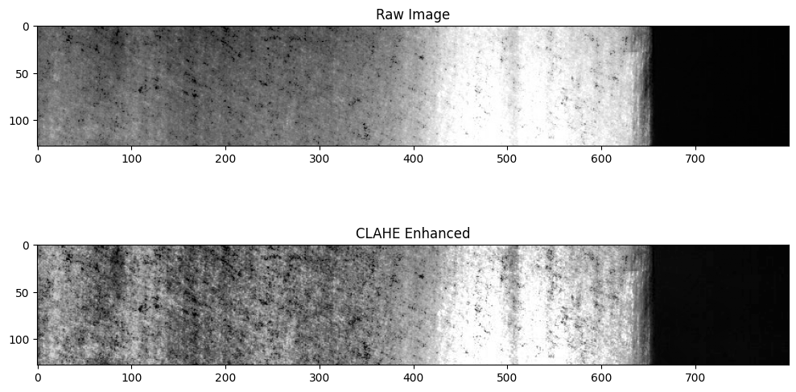

# Guided Learning: Photometric Separation vs. Pure Texture Anomalies (Cohen's $d$)
*(Preparing for Milestone 1: Question 6)*

---

## 1. How Do You Distinguish Anomalies?
When presented with an anomaly detection problem, a natural first question is:
*"Can we detect this defect simply by looking at pixel brightness?"*

If defect pixels are substantially brighter or darker than the clean metal surface, a simple threshold (like Otsu's method or an adaptive mean filter) could solve the problem without deep learning!

But "substantially brighter" is vague. To evaluate this rigorously, computer vision scientists measure the **statistical effect size** between defect pixels and local background pixels — a single number that answers: *"how separated are these two groups of pixel values, really?"*

Think of it as asking two histograms (defect pixels vs. background pixels) to sit side by side: do they overlap almost completely, or are they clearly apart?

---

## 2. Statistical Foundation: Cohen's $d$ (Jacob Cohen, 1988)
Cohen's $d$ is a standardized measure of the difference between two sample means, normalized by their pooled standard deviation:

$$d = \frac{\mu_{\text{defect}} - \mu_{\text{background}}}{s_{\text{pooled}}}$$

**Reading the formula intuitively:**
* The **numerator** $\mu_{\text{defect}} - \mu_{\text{background}}$ is the raw gap between the average defect pixel and the average background pixel.
* The **denominator** $s_{\text{pooled}}$ is the typical spread (standard deviation) of pixel values within each group.
* Dividing gap-by-spread makes $d$ a **unitless** number: $d = 1.0$ means the two means are separated by one full standard deviation, regardless of whether pixel values range over 0–255 or 0–1.

**Why not just use the raw difference?** Because a gap of "10 gray levels" means nothing without context — if pixel values fluctuate wildly (spread of 50), a gap of 10 is invisible; if values are extremely stable (spread of 2), a gap of 10 is obvious. Cohen's $d$ accounts for the noise.

The pooled standard deviation across sample sizes $n_1, n_2$ with variances $s_1^2, s_2^2$ is:
$$s_{\text{pooled}} = \sqrt{\frac{(n_1 - 1)s_1^2 + (n_2 - 1)s_2^2}{n_1 + n_2 - 2}}$$

(You do not need to memorize this — just know it is a weighted average of the two groups' spreads, weighted by sample size.)

### Rule of Thumb for Effect Sizes (Cohen, 1988):
* $|d| < 0.2$: **Negligible difference** (histograms almost completely overlap — a brightness threshold cannot separate them).
* $|d| \approx 0.5$: **Moderate separation** (noticeable difference — thresholding is possible but error-prone).
* $|d| \ge 0.8$: **Large separation** (clearly distinguishable populations — a simple threshold works).

Note that $d$ can be **negative** if the defect is *darker* than the background — the sign tells you the direction of the shift, and $|d|$ (absolute value) tells you the magnitude.

### Seeing contrast enhanced: does it rescue a weak $d$?
Contrast-limited adaptive histogram equalization (CLAHE) re-amplifies local contrast *without* adding new information. Ask yourself what happens to two overlapping histograms when you apply it:

*Figure 5.1: Contrast-limited adaptive histogram equalization exposes local structure. If the defect and background histograms already overlap (tiny $d$), does CLAHE create separation — or just stretch the same overlapping distributions?*

---

## 3. Photometric Defects vs. Texture Defects

Not all defects announce themselves through brightness. This is the central lesson of this guide:

### Case A: Photometric (Intensity-Dominant) Defects
* **Physical Cause:** Pits, oxidation stains, holes, or raised specular scratches that reflect light directly into the camera lens.
* **Histogram Signature:** Defect pixel values are significantly shifted from the surrounding sheet ($|d| > 0.5$).
* **Detection:** Easily localized by first-order pixel intensity differences — a simple threshold or classical edge detector may suffice.
* **Example intuition:** A dark oil stain on bright steel is obviously darker; the two histograms barely overlap.

### Case B: Texture (Structural) Defects
* **Physical Cause:** Roll chatter, roughness variations, micro-abrasions, or grain boundary disturbances.
* **Histogram Signature:** The mean grayscale intensity of defect pixels is virtually identical to the clean background ($|d| \approx 0.0$).
* **Detection:** **Photometrically invisible.** Any simple brightness threshold that triggers on the defect will also trigger on the entire background! These anomalies can only be detected by learned multiscale spatial patterns (convolutional features, frequency band filters, or texture descriptors like GLCM).
* **Example intuition:** Roughness changes the *arrangement* of bright/dark micro-patterns, not their average — imagine sanding a checkerboard versus a plain sheet: the same average brightness, very different texture.

### Why this distinction drives architecture choices
* Photometric defects → shallow classical CV *might* work.
* Texture defects → you need a network with enough receptive field to compare *spatial patterns*, not just single-pixel values. This is why U-Net style encoders (which aggregate context across scales) are appropriate, and why simple thresholding baselines will systematically miss one class.

**Your measurement task:** the assignment asks you to compute Cohen's $d$ for each of the four defect classes and identify which one falls at the "negligible" end of the scale — then argue which feature type (intensity vs. texture) that class demands. The numbers must come from *your* script; this guide deliberately teaches the method on toy statistics so the graded values stay yours to find.

---

## 4. Official Trusted Resources & Recommended Reading
* **Cohen, Jacob. (1988).** *Statistical Power Analysis for the Behavioral Sciences* (2nd ed.). Lawrence Erlbaum Associates. ISBN: 978-0-8058-0283-2.
* **Haralick, R. M., Shanmugam, K., & Dinstein, I. (1973).** *Textural Features for Image Classification*. IEEE Transactions on Systems, Man, and Cybernetics, SMC-3(6), 610–621. [DOI: 10.1109/TSMC.1973.4309314](https://doi.org/10.1109/TSMC.1973.4309314).
* **OpenCV Image Thresholding Tutorial:**
  [Otsu's Binarization and Image Segmentation](https://docs.opencv.org/4.x/d7/d4d/tutorial_py_thresholding.html).

---

## 5. Practice Problems: Cohen's $d$ on Toy Statistics

### Practice Problem 5.1 — Compute $d$ and classify each class
Three toy defect classes were measured on their images. For each, compute $d = (\mu_{\text{defect}} - \mu_{\text{bg}}) / s_{\text{pooled}}$ and classify it as negligible / moderate / large:

1. **Class P:** $\mu_{\text{defect}} = 140$, $\mu_{\text{bg}} = 95$, $s_{\text{pooled}} = 45$.
2. **Class Q:** $\mu_{\text{defect}} = 101.5$, $\mu_{\text{bg}} = 99.0$, $s_{\text{pooled}} = 25$.
3. **Class R:** $\mu_{\text{defect}} = 80$, $\mu_{\text{bg}} = 100$, $s_{\text{pooled}} = 50$.

For each class, state whether a simple grayscale threshold could plausibly work, and what feature type (intensity vs. texture) you would rely on.

<b>Worked Solution</b>

1. Class P: $d = (140 - 95)/45 = 45/45 = \mathbf{+1.00}$ → **large separation**. A brightness threshold should work well; first-order intensity features suffice.
2. Class Q: $d = (101.5 - 99.0)/25 = 2.5/25 = \mathbf{+0.10}$ → **negligible** ($|d| < 0.2$). Histograms overlap almost completely — thresholding will fire on background as readily as on defect. This class needs **texture / spatial** features.
3. Class R: $d = (80 - 100)/50 = -20/50 = \mathbf{-0.40}$ → **moderate**, and the **negative sign** means the defect is *darker* than the background. Thresholding is possible but error-prone; consider local/adaptive thresholds or learned features.

Note how raw gaps alone mislead: Class P's gap (45) is only $2.25\times$ Class R's gap (20), yet $d$ separates them $2.5\times$ more — and Class Q's small gap is made *even smaller* relative to its spread. The normalization is the whole point.

### Practice Problem 5.2 — Why means can hide a texture defect
Class Q from Problem 5.1 has $\mu_{\text{defect}} = 101.5$ and $\mu_{\text{bg}} = 99.0$. Two students disagree:

* **Student A:** "The gap is only 2.5 gray levels — practically invisible; Q must be undetectable."
* **Student B:** "2.5 gray levels might still be detectable if the background were perfectly uniform."

Who is right, and what does $s_{\text{pooled}} = 25$ tell you about which student's framing is already correct? Then answer: if a defect changed the *spatial arrangement* of pixels while leaving the mean unchanged, what would $d$ be, and why would a convolutional network still find it?

<b>Worked Solution</b>

Both students are half-right, but the **statistic settles it**: detectability depends on gap *relative to spread*. With $s_{\text{pooled}} = 25$, natural pixel fluctuations are $10\times$ the gap ($25$ vs. $2.5$) — so Student B's "if the background were perfectly uniform" condition is exactly what $s_{\text{pooled}} = 25$ says is *not* the case. $d = 0.10$ confirms near-total histogram overlap.

If a defect changes only spatial arrangement with the same mean, then $\mu_{\text{defect}} \approx \mu_{\text{bg}}$ and $d \approx 0$ — first-order intensity statistics are *blind by construction*. A convolutional network still detects it because its filters compare **neighborhoods**: edges, periodicities, and frequency content change even when the histogram does not. This is the formal reason texture classes force you away from thresholding and toward learned multi-scale features.

---

## 6. Your Assignment Task

Open the graded assignment: [`MILESTONE_1.md`](../../MILESTONE_1.md)

* **Question 6** asks you to compute Cohen's $d$ for **each defect class** in the real data (defect-region pixels vs. same-image background pixels), apply the assignment's negligible-effect cutoff, and name which class fails it — plus the feature type that class requires.
* Practice Problems 5.1–5.2 gave you the arithmetic and the interpretation rubric; your script must produce the four real $d$ values. Aggregate the pixel populations carefully (per-class masks decoded from `train.csv`, background = mask $= 0$ on the same image).

Neither the class identity nor its $d$ value appears in this guide — compute them yourself.
