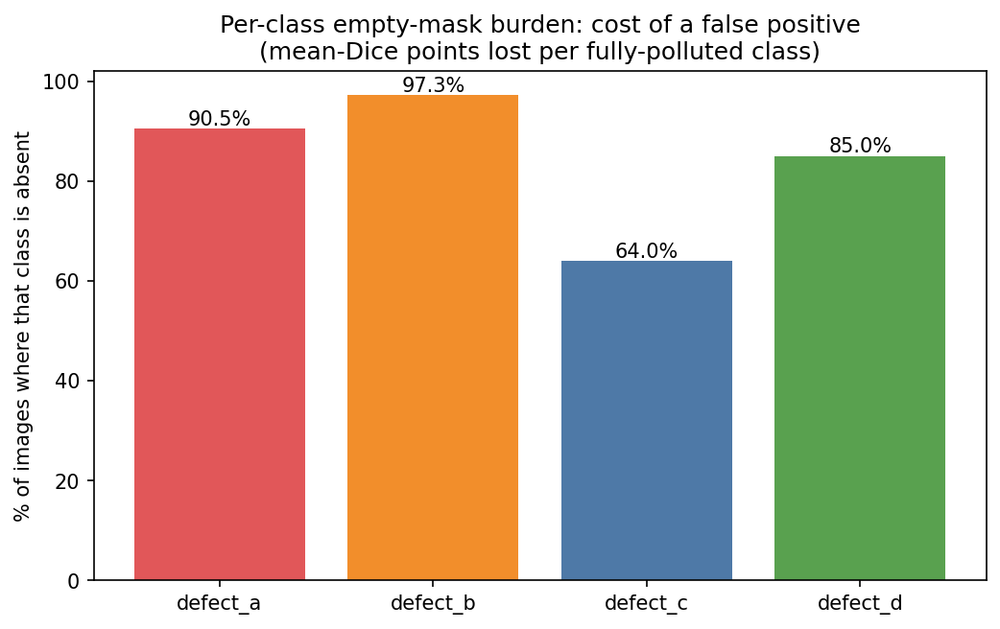

# The Sørensen–Dice Index and Negative Step Functions
*(Preparing for Milestone 1: Question 7)*

---

## 1. What is the Sørensen–Dice Index?
The Sørensen–Dice Similarity Coefficient (DSC) is the most ubiquitous evaluation metric in semantic segmentation.

### Historical Origins:
* **Lee R. Dice (1945):** Formulated in *Ecology* (26(3): 297–302) to evaluate species co-occurrence across sampling areas.
* **Thorvald Sørensen (1948):** Independently developed in botany (*Kgl. Danske Vidensk. Selsk.* 5(4): 1–34) as the Quotient of Similarity.

### Mathematical Definition:
For a predicted binary mask $X$ and a ground-truth binary mask $Y$:
$$\text{Dice}(X, Y) = \frac{2 |X \cap Y|}{|X| + |Y|}$$

**Reading the formula intuitively:** $|X \cap Y|$ counts pixels where *both* prediction and ground truth are 1 (correctly detected defect pixels — the "agreement"). $|X| + |Y|$ counts all foreground pixels from both masks put together. Doubling the agreement term means a *perfect* match ($X = Y$) gives $\frac{2|X|}{2|X|} = 1.0$, while no agreement at all gives $0$.

In terms of confusion matrix counts (where $|X \cap Y| = \text{TP}$, $|X| = \text{TP} + \text{FP}$, and $|Y| = \text{TP} + \text{FN}$):
$$\text{Dice} = \frac{2 \cdot \text{TP}}{2 \cdot \text{TP} + \text{FP} + \text{FN}} \equiv F_1 \text{-Score}$$

**Why Dice instead of plain accuracy?** In a $128 \times 800$ image where defects may cover only $<0.02\%$ of pixels, a model that predicts "all background" achieves $\approx 99.98\%$ pixel accuracy while detecting nothing. Dice only looks at foreground pixels, so all-background predictions are penalized properly.

### A tiny numeric example
Suppose ground truth has $|Y| = 100$ defect pixels and your prediction has $|X| = 80$ pixels, of which $60$ overlap the ground truth ($\text{TP} = 60$):
$$\text{Dice} = \frac{2(60)}{80 + 100} = \frac{120}{180} \approx 0.667$$
Compare with IoU: $\text{IoU} = \frac{60}{80 + 100 - 60} = \frac{60}{120} = 0.5$. Dice is always *larger* than IoU for the same overlap — useful to know when comparing papers.

---

## 2. The Empty-Mask Dilemma: Handling $0 / 0$
In surface anomaly detection, clean images have no defect pixels ($|Y| = 0$).
If the model correctly predicts no defect pixels ($|X| = 0$), what is the Dice score?
$$\text{Dice}(\emptyset, \emptyset) = \frac{2(0)}{0 + 0} = \frac{0}{0} \quad (\text{Indeterminate!})$$

Division by zero is undefined in arithmetic — the formula simply does not say what to do when *both* masks are empty. Every framework and benchmark must therefore adopt an explicit **convention** (an arbitrary but consistent rule).

### The Standard Industry Convention:
In Kaggle and biomedical segmentation benchmarks, the convention is defined as:
$$\text{Dice}(X, Y) = \begin{cases} 
1.0 & \text{if } |X| = 0 \text{ and } |Y| = 0 \\ 
0.0 & \text{if } (|X| > 0 \text{ and } |Y| = 0) \text{ or } (|X| = 0 \text{ and } |Y| > 0) \\
\frac{2|X \cap Y|}{|X| + |Y|} & \text{if } |X| > 0 \text{ and } |Y| > 0 
\end{cases}$$

**Translating the three cases into plain English:**
1. **Both empty → 1.0:** The model correctly said "nothing here," and ground truth agrees. Perfect — full credit.
2. **One empty, the other not → 0.0:** Either a false alarm (model predicted defect on a clean image) or a total miss (model predicted nothing on a defective image). Worst case — zero credit.
3. **Both non-empty → the formula:** Normal overlap scoring as in Section 1.

> **Important:** Case 2 is where the pain lives. A *single* stray predicted pixel flips an empty-image score from 1.0 to 0.0 — a total cliff, not a gentle slope. This asymmetry is the subject of Section 3.

---

## 3. The Negative Step-Function Penalty
Look closely at what happens when the ground truth has no defect ($|Y| = 0$):
$$\text{Dice}(X, \emptyset) = \begin{cases} 1.0 & \text{if } |X| = 0 \\ 0.0 & \text{if } |X| \ge 1 \end{cases}$$

This is a **discontinuous Heaviside step function**! Plot Dice against the number of predicted pixels on an empty image and you see a cliff: the score sits at 1.0 for zero predicted pixels and drops *instantly* to 0.0 the moment even one pixel is predicted. There is no "partially correct" zone — and note that the formula does not care *how many* pixels were predicted: whether the hallucination is one pixel or ten thousand, $|X \cap Y| = 0$ pins the numerator at zero, so the score is $0$.

### The Radical Asymmetry (the same amount of noise, opposite consequences):
* **On a Positive Defect Image ($|Y| = 5,000\text{ px}$):**
  If your model predicts 2 stray noise pixels ($|X| = 5,002\text{ px}$), the score is:
  $$\text{Dice} = \frac{2(5,000)}{5,002 + 5,000} = \frac{10,000}{10,002} \approx \mathbf{0.9998} \quad (\text{virtually zero penalty})$$
* **On an Empty Image ($|Y| = 0\text{ px}$):**
  Any non-empty prediction is scored by case 2 of the convention — the score is $0.0$ regardless of how few pixels were predicted. (Work the arithmetic out yourself on concrete numbers in Practice Problem 6.2.)

**Why such different outcomes?** On the positive image, the 2 noise pixels are a tiny fraction of 5,002 total — the formula barely notices. On the empty image, those same pixels are the *entire* prediction, and since ground truth is 0, the numerator $2|X \cap Y|$ is structurally stuck at zero. The denominator grows but the numerator cannot move.

A model that hallucinates even a single speckle on an empty image loses all credit for that image.

### Why you should care during model design
This step function creates a perverse incentive: aggressively predicting "nothing" on uncertain images *maximizes* empty-image scores. This is precisely the trap that motivates the competition's composite metric (Guide 7) — a pure mean-Dice over all pairs can be gamed by a model that mostly abstains.

This discontinuity is not an abstraction — it dominates the training signal in this dataset, where a large share of all image-class pairs carry no mask at all:

*Figure 6.2: Fraction of images on which each class is absent. Every one of those pairs sits on the step-function plateau — a single stray pixel drops it from 1.0 to 0.0. Which classes sit on the most empty pairs?*

---

## 4. Official Trusted Resources & Recommended Reading
* **Dice, Lee R. (1945).** *Measures of the Amount of Ecologic Association Between Species*. Ecology, 26(3), 297–302. [DOI: 10.2307/1932409](https://doi.org/10.2307/1932409).
* **Sørensen, Thorvald. (1948).** *A method of establishing groups of equal amplitude in plant sociology*. Kgl. Danske Vidensk. Selsk. Biol. Skr. 5(4): 1–34.
* **Carass, A., et al. (2020).** *Evaluating Image Segmentation in the Era of Deep Learning*. IEEE Transactions on Medical Imaging. [DOI: 10.1109/TMI.2020.3013247](https://doi.org/10.1109/TMI.2020.3013247).

---

## 5. Practice Problems: Scoring Toy Masks Under the Convention

### Practice Problem 6.1 — Both masks non-empty (and the total-miss case)
Ground truth: $|Y| = 3{,}000$ pixels. Your model predicts $|X| = 3{,}100$ pixels, of which $|X \cap Y| = 2{,}800$ overlap.

1. Compute the Dice score.
2. Now suppose the model predicts $\hat{X} = \emptyset$ on that same defective image ($|X| = 0$). Compute the Dice score. Which case of the convention applies?

<b>Worked Solution</b>

1. $\text{Dice} = \frac{2 \times 2{,}800}{3{,}100 + 3{,}000} = \frac{5{,}600}{6{,}100} \approx \mathbf{0.9180}$.
2. Case 2 of the convention ($|X| = 0$, $|Y| > 0$ — total miss) → $\text{Dice} = \mathbf{0.0}$. You can also see it as the formula's limit: $2(0)/(0 + 3000) = 0$. Even a model that gets *most* pixels right receives nothing if it predicts no foreground at all on a defective image.

### Practice Problem 6.2 — Empty ground truth: feel the cliff
Ground truth: $|Y| = 0$ (clean image).

1. Model A predicts $\hat{X}_A = \emptyset$. What is the Dice score?
2. Model B predicts $\hat{X}_B$ with exactly 7 stray pixels. Compute $\text{Dice}(\hat{X}_B, \emptyset)$ **from the raw formula** ($2|X \cap Y| / (|X| + |Y|)$), noting that a hallucinated pixel can never be in the intersection.
3. Model C predicts 7 stray pixels on a **positive** image with $|Y| = 3{,}000$, all inside the ground truth ($|X \cap Y| = 3{,}000$, so $|X| = 3{,}007$). Compute its Dice. Compare with your answer to (2): what exactly causes the enormous difference?
4. True or false: *"On an empty image, predicting 7 pixels is $7\times$ worse than predicting 1 pixel."* Justify using the formula.

<b>Worked Solution</b>

1. Both empty → convention case 1 → $\text{Dice} = \mathbf{1.0}$.
2. $|X \cap Y| = 0$ (nothing to intersect), so $\text{Dice} = \frac{2 \times 0}{7 + 0} = \frac{0}{7} = \mathbf{0.0}$.
3. $\text{Dice} = \frac{2 \times 3{,}000}{3{,}007 + 3{,}000} = \frac{6{,}000}{6{,}007} \approx \mathbf{0.9988}$ — the same 7 pixels cost almost nothing.
4. **False.** The score does not depend on the hallucination size at all: for *any* $|X| \ge 1$, the numerator is forced to 0, so the Dice is 0. Seven stray pixels and one stray pixel are equally catastrophic — the penalty is a step, not a slope. (This is exactly why the composite metric in Guide 7 replaces this term with a *volume-proportional* penalty on empty images.)

---

## 6. Your Assignment Task

Open the graded assignment: [`MILESTONE_1.md`](../../MILESTONE_1.md)

* **Question 7** presents two models on an empty ground truth and asks for both Dice scores plus a reflection on what the pair demonstrates about false-positive penalties.
* You have already practiced both halves of the convention in Problems 6.1–6.2 — apply them to the assignment's specific scenario, state both exact values, and write the reflection in your own words (compare against the positive-image behavior from Problem 6.1(1)).

The scoring rule is fixed and given to you in the question; the graded work is carrying it out correctly and explaining the asymmetry.
