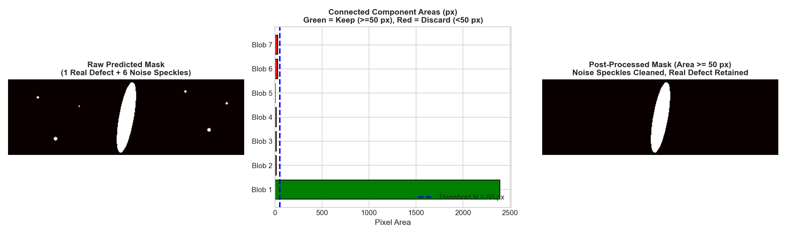
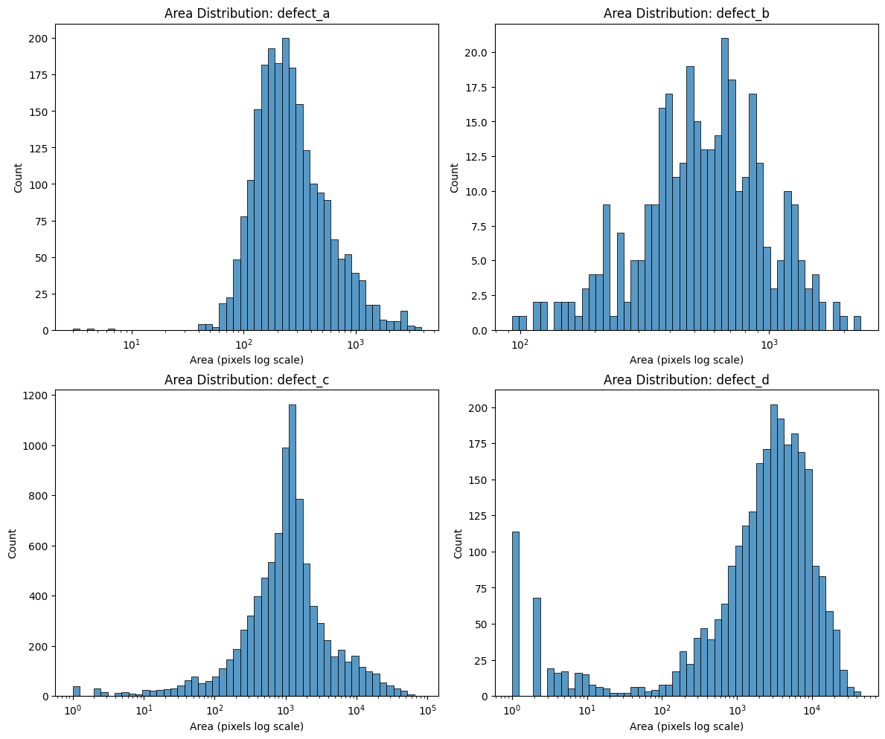

# Morphological Post-Processing, Connected Components, and Recall Ceilings
*(Preparing for Milestone 1: Question 10)*

---

## 1. Why Deep Models Produce Noise Speckles
Even the best semantic segmentation models (e.g., U-Net with ResNet-34) output imperfect probability maps. After thresholding probabilities at $\tau = 0.5$, raw predicted masks typically contain two types of objects:
1. **Real Defect Instances:** Large, contiguous structural flaws.
2. **Spurious False Alarm Speckles:** Tiny, isolated clusters of $1$ to $20$ pixels triggered by surface reflections, texture noise, or illumination gradients.

**Where do speckles come from?** A segmentation network assigns a probability to every pixel independently-ish. On a clean image, most pixels get $p \approx 0.01$, but random texture fluctuations can push a handful of pixels just over $0.5$. These stragglers are not "defects" — they are statistical noise at the decision boundary.

On clean images, these stray pixels degrade your False Positive Score and wipe out your Empty Prediction Accuracy (Guide 7). So we need a cleanup step — but cleanup has a cost, which is the core trade-off of this guide.

---

## 2. Connected-Component Labeling (CCL)
Connected-Component Labeling scans a binary mask and groups contiguous pixels into distinct labeled blobs. After running it, every blob gets a unique integer label, and you can measure each blob's properties (area, bounding box, centroid).


*Figure 8.1: Connected component area filtering removes noise speckles while preserving real defect morphology (illustration on a synthetic mask).*

**What the algorithm does, concretely:** imagine pouring water on the binary mask — connected foreground regions form separate "islands." CCL numbers each island 1, 2, 3, … so you can ask "how big is island #7?" (its area) and decide whether to keep or delete it.

### 4-Way vs. 8-Way Connectivity:
* **4-Connectivity:** Considers pixels connected only if they share an edge (horizontal or vertical neighbor).
* **8-Connectivity:** Considers pixels connected if they share an edge or a **corner** (diagonal neighbor).

> **Why 8-Connectivity is Essential for Defect Inspection:**
> Thin mechanical cracks often traverse diagonally across the pixel grid. Under 4-connectivity, a continuous diagonal crack splits into dozens of isolated 1-pixel components! Under 8-connectivity, it remains a single coherent instance. For this dataset — where thin diagonal cracks are common — always use `connectivity=8`.

### OpenCV Implementation:
OpenCV provides an optimized implementation of the two-pass Scan Array-Based Union-Find (SAUF) algorithm:
```python
import cv2

num_labels, labels, stats, centroids = cv2.connectedComponentsWithStats(
    binary_mask.astype(np.uint8), connectivity=8
)
# labels:    int array, same shape as mask; 0 = background, 1..num_labels-1 = blobs
# stats[lbl, cv2.CC_STAT_AREA] returns the area in pixels of component 'lbl'
# stats[lbl, cv2.CC_STAT_LEFT/TOP/WIDTH/HEIGHT] gives its bounding box
```
Note that `num_labels` includes the background label 0, so actual blobs are `1 .. num_labels-1`.

---

## 3. The Minimum-Area Filter & The Recall Ceiling
A common post-processing strategy is **minimum area filtering**:
Any connected component with area $< N$ pixels is set to 0 (discarded as noise).

**The intuition:** real defects tend to be large contiguous regions; speckles tend to be tiny. Setting $N$ to some modest number should delete most speckles while keeping real defects.

### The Mathematical Trade-off:
* **Benefit:** Suppresses small noise speckles on clean images, dramatically boosting specificity (higher False Positive Score and Empty Accuracy).
* **Risk (The Recall Ceiling):** What if a real ground-truth defect happens to have an area smaller than $N$?
  If a true defect is smaller than $N$, your post-processing filter will delete it, even if your neural network predicted it perfectly! No amount of model improvement can recover those pixels — the ceiling is imposed by *your own post-processing*, not the model.

The theoretical maximum recall achievable under filter threshold $N$ is:
$$\text{Recall}_{\text{ceiling}}(N) = 1 - \frac{\sum_{G_k \in \mathcal{G}, |G_k| < N} |G_k|}{\sum_{G_k \in \mathcal{G}} |G_k|}$$
where $\mathcal{G}$ is the set of all ground-truth defect components.

**Reading the formula:** the fraction being subtracted is *the share of all defect pixels that live in components smaller than $N$*. Those pixels are doomed — your filter guarantees they will be erased. So recall = (pixels you could theoretically keep) ÷ (all defect pixels).

**A concrete number to build intuition:** suppose there are 1,000,000 total defect pixels, and 20,000 of them sit in components smaller than $N=50$. Then $\text{Recall}_{\text{ceiling}} = 1 - 20000/1000000 = 0.98$ — even a *perfect* model can reach at most 98% recall with that threshold.

Before choosing a threshold $N$, you must know the area distribution of real defects — the ceiling formula is only useful if you know the smallest real components:


*Figure 8.2: Distribution of ground-truth defect component areas, per class (log-scale histograms). Which class populates the far-left tail of small components? What does that imply for how aggressively you may filter that class?*

> **Key insight:** classes differ drastically in component size. A threshold that is safe for one class may silently destroy another. Always check the ceiling *per class* before committing to an $N$ — and note the difference between *counting blobs* and *counting pixels*: a filter can delete many tiny components while barely denting the pixel-level ceiling, or delete a single mid-sized component and lose a large share of the signal.

---

## 4. Official Trusted Resources & Recommended Reading
* **Rosenfeld, A., & Pfaltz, J. L. (1966).** *Sequential Operations in Digital Picture Processing*. Journal of the ACM (JACM), 13(4), 471–494. [DOI: 10.1145/321356.321357](https://doi.org/10.1145/321356.321357).
* **Wu, K., Otoo, E., & Suzuki, K. (2009).** *Optimizing two-pass connected-component labeling algorithms*. Pattern Analysis and Applications, 12(2), 117–135. [DOI: 10.1007/s10044-008-0109-y](https://doi.org/10.1007/s10044-008-0109-y).
* **OpenCV Structural Analysis Documentation:**
  [`cv2.connectedComponentsWithStats`](https://docs.opencv.org/4.x/d3/dc0/group__imgproc__shape.html#ga107a78bf7cd25dec05fb4dfc5c9e765f).

---

## 5. Practice Problems: Recall Ceilings on Toy Component Areas

### Practice Problem 8.1 — Apply the ceiling formula
Two toy classes' ground-truth components (areas in pixels):

* **Class $\alpha$:** $[40,\ 120,\ 340,\ 5{,}100]$
* **Class $\beta$:** $[48,\ 90,\ 5{,}000]$

1. What is the smallest component area of class $\alpha$?
2. With a minimum-area filter at $N = 50$: what **percentage** of class $\alpha$'s ground-truth *pixels* is discarded?
3. With $N = 50$: what percentage of class $\beta$'s ground-truth *pixels* is discarded?
4. With $N = 200$: what is class $\alpha$'s recall ceiling (to 4 decimal places)?
5. Class $\alpha$'s smallest component (40 px) sits below $N = 50$, yet the pixel loss at $N = 50$ is under 1%. Explain why these two facts are consistent, and why the *percentage of blobs* removed would look much scarier than the percentage of *pixels* removed.

<details>
<summary><b>Worked Solution</b></summary>

1. $\min(\alpha) = \mathbf{40\text{ px}}$.
2. Components below 50: only $[40]$. Total $\alpha$ pixels $= 40 + 120 + 340 + 5{,}100 = 5{,}600$.
   $$\text{lost} = \frac{40}{5{,}600} = 0.00714 = \mathbf{0.71\%}$$
3. Components below 50: only $[48]$. Total $\beta$ pixels $= 48 + 90 + 5{,}000 = 5{,}138$.
   $$\text{lost} = \frac{48}{5{,}138} \approx 0.00934 = \mathbf{0.93\%}$$
4. Components below 200: $[40, 120]$ → discarded pixels $= 160$.
   $$\text{Recall}_{\text{ceiling}}(200) = 1 - \frac{160}{5{,}600} = 1 - 0.02857 = \mathbf{0.9714}$$
5. **Consistency:** the ceiling formula is *pixel-weighted*, not blob-counted. The 40-px component is 1 of 4 blobs (**25% of blobs**!) but carries only $40/5{,}600$ of the pixels (**0.71%**). Tiny components dominate blob statistics and vanish in pixel statistics — which is why the guide insists you check *both* views: blob-loss tells you how many *instances* you will erase (matters for detection metrics counting instances), pixel-loss sets the recall ceiling for a Dice computed over pixels.

</details>

### Practice Problem 8.2 — Choose $N$ under a constraint
You may tolerate at most **1.0%** pixel loss for *any* single class. Using the same toy areas, the candidate thresholds are $N \in \{30, 50, 100, 200\}$:

1. For each $N$, compute the pixel loss for classes $\alpha$ and $\beta$ (loss = share of pixels in components with area $< N$).
2. Which $N$ values satisfy the 1.0% constraint for **both** classes?
3. What extra information would you need from the *predictions* (not the ground truth) before finalizing $N$ — and why can't the ground-truth ceiling alone pick the winning threshold?

<details>
<summary><b>Worked Solution</b></summary>

1. Losses (component sums over totals $5{,}600$ and $5{,}138$):
   * $N = 30$: none below → $\alpha$: **0.00%**, $\beta$: **0.00%**
   * $N = 50$: $40$ and $48$ → $\alpha$: **0.71%**, $\beta$: **0.93%**
   * $N = 100$: $40$ and $48{+}90{=}138$ → $\alpha$: $40/5{,}600$ = **0.71%**, $\beta$: $138/5{,}138$ = **2.69%**
   * $N = 200$: $40{+}120{=}160$ and $138$ → $\alpha$: $160/5{,}600$ = **2.86%**, $\beta$: **2.69%**
2. $N \in \{30, 50\}$ satisfy $\le 1.0\%$ for both classes.
3. The ceiling only bounds recall — it says nothing about how much **noise** each $N$ removes from the *predictions*. You also need the predicted-component area distribution on clean/empty images (or the FP-score/empty-accuracy deltas from a sweep) to see which $N$ actually improves your score. The optimal $N$ sits where marginal noise removal still exceeds marginal GT loss: ground truth sets the ceiling, predictions set the benefit.

</details>

---

## 6. Your Assignment Task

Open the graded assignment: [`MILESTONE_1.md`](../../MILESTONE_1.md)

* **Question 10** asks you to run connected-component analysis over the **real** ground-truth masks in `data/public/train.csv` (decode with `rle_decode` from Guide 3, then `cv2.connectedComponentsWithStats(..., connectivity=8)` per mask) and report: the smallest GT component of a specified class, and the pixel-loss percentages at two specified filter thresholds for specified classes.
* Practice Problems 8.1–8.2 rehearsed every formula on toy areas — your script must produce the real area lists from the data.

Nothing in this guide states how the real distributions behave; Figure 8.2 shows shape only, and exact values must come from your own analysis.
